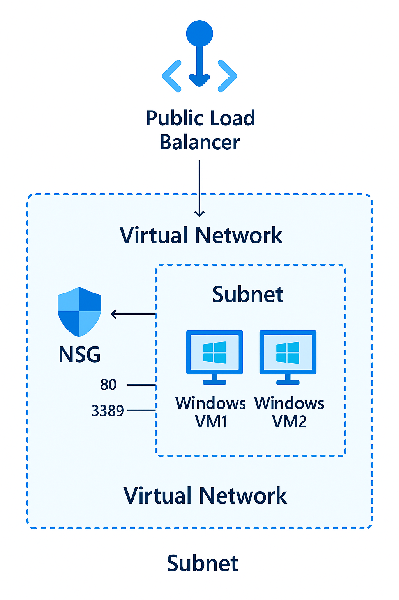

# Azure Deployment: Virtual Machine with Load Balancer

This repository contains the infrastructure as code (IaC) for deploying a Virtual Machine (VM) with a Load Balancer on Microsoft Azure. The deployment is managed using Azure Bicep templates and is designed to provide a scalable and reliable architecture.

## Repository Structure

- **azure.yaml**: Configuration file for Azure Developer CLI (azd).
- **demoguide/**
  - `demoguide.md`: Step-by-step guide for deploying and managing the resources.
- **images/**
  - `vmwithlb.png`: Architecture diagram for the deployment.
- **infra/**
  - `abbreviations.json`: JSON file containing abbreviations used in the project.
  - `main.bicep`: Main Bicep template for orchestrating the deployment.
  - `main.parameters.json`: Parameters file for the main Bicep template.
  - `resources.bicep`: Bicep module for shared resources.
  - `vm.bicep`: Bicep module for Virtual Machine resources.

## Prerequisites

1. **Azure Subscription**: Ensure you have an active Azure subscription.
2. **Azure CLI**: Install the [Azure CLI](https://learn.microsoft.com/en-us/cli/azure/install-azure-cli).
3. **Azure Developer CLI (azd)**: Install the [Azure Developer CLI](https://learn.microsoft.com/en-us/azure/developer/azure-developer-cli/overview).
4. **Bicep CLI**: Install the [Bicep CLI](https://learn.microsoft.com/en-us/azure/azure-resource-manager/bicep/install).

## Deployment Steps

1. Clone the repository:
   ```powershell
   git clone https://github.com/trainerkrunal/azd-vmwithlb.git
   cd azd-vmwithlb
   ```

2. Initialize the Azure Developer CLI:
   ```powershell
   azd init
   ```

3. Provision the infrastructure:
   ```powershell
   azd up
   ```
   This command will deploy the resources defined in the Bicep templates.

4. Verify the deployment:
   - Navigate to the Azure Portal.
   - Check the deployed resources (VM, Load Balancer, etc.) in the specified resource group.

## Architecture Diagram



## Contributing

Contributions are welcome! Please fork the repository and submit a pull request for any changes.

## License

This project is licensed under the MIT License. See the [LICENSE](LICENSE) file for details.

## Contact

For any questions or support, please contact [trainerkrunal](https://github.com/trainerkrunal).
